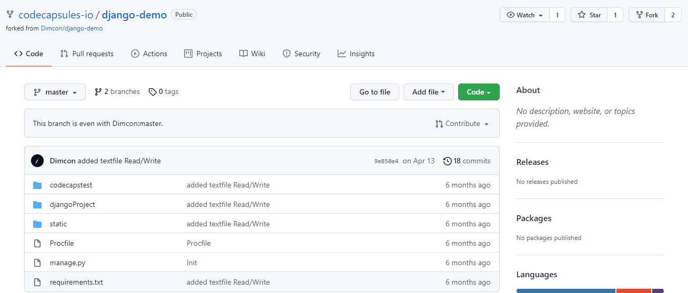

# How to Deploy a Django Application to Production on Code Capsules

Deploy a Django application that makes use of templates to render its frontend from a Backend Capsule.

## Getting Started

This guide provides instructions on how to deploy a Django application to Code Capsules using a [demo-django application](https://github.com/codecapsules-io/django-demo) that can be found on Code Capsules GitHub account. 

When deployed, the example application will display a "Hello World" message on its index page and can be easily extended to add other features. Start by forking the example application mentioned above to your own GitHub account. 

## Linking to GitHub

The next step is to link the forked repository to your Code Capsules account. You can do this by clicking your profile image at the top right of your screen in Code Capsules. 

Once on the "Profile" tab click the "GitHub" button to start the process of linking to the repo. 

You now need to authorise Code Capsules to connect to the Django application by:

1. Clicking your GitHub username.
2. Selecting "Only Select Repositories".
3. Choosing the GitHub repository we forked.
4. Pressing "Install & Authorize".

After you've clicked the "Install & Authorize" button, Code Capsules will link to the GitHub repository containing the Django application. 

## Add Repo to Team

The next step is to add the repository to our "Personal Team" so that all Capsules created under that Team can read its data.

Click on "Team Settings" on the top navigation bar to switch to the _Team Settings_ tab. Once there, click on the "Modify" button under the _Team Repos_ section to add the repo to your Personal Team. When the "Edit Team Repos" screen slides in, select "Add" next to the repo you want to add to your Personal Team and then confirm. 

## Create a Space for Your App

Create a Space to contain the Backend Capsule that will host the django application we'll deploy shortly. To do this, navigate to the "Spaces" tab and click on the "Create A New Space For Your Apps" button.

When this is done, a screen similar to the one shown below should slide in from the right.

Select an appropriate region and enter a name for your space and press "Create Space".

## Create the Capsule

Create a Backend Capsule by clicking on the "Create a New Capsule for Your Space" button from inside your Space.

Choose a Backend Capsule on the screen that follows, then:

1. Select the "Sandbox" product.
2. Choose the GitHub repository we forked.
3. Press next.
4. Leave the "Run Command" blank and create the Capsule.

## View Logs

While the Capsule is building, you can view its logs under the "Build and Deploy" tab in the Capsule. Once built, you can navigate to the "Overview" tab and click on the provided URL to view the application. 

For a better understanding of Capsules, take a look at [this explanation](https://codecapsules.io/docs/FAQ/what-is-a-capsule).

If you'd like to deploy your own Django application, take a close look at the [Django repository](https://github.com/codecapsules-io/django-demo) we forked. There, you'll find a file named `Procfile`. Code Capsules reads Procfiles to build and deploy Django applications. [Click here](https://pythonhosted.org/deis/using_deis/process-types/) to read more about Procfiles.