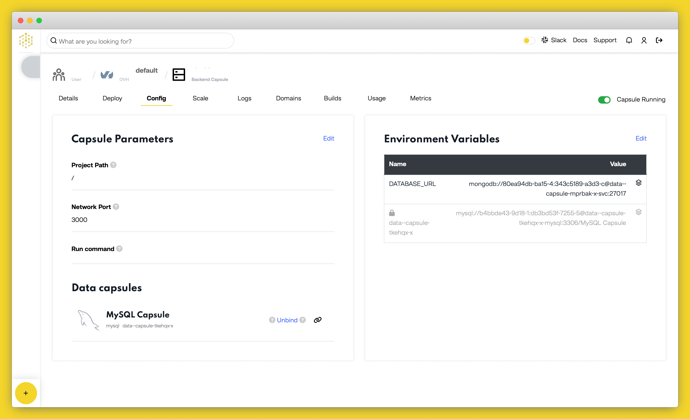

# How to Deploy a Django MySQL Application to Production on Code Capsules

Deploy a Django MySQL application and learn how to host backend code on Code Capsules.

## Set up

Code Capsules connects to GitHub repositories to deploy applications. To follow this guide, you’ll need a [Code Capsules](https://codecapsules.io/) account and a [GitHub](https://github.com/) account.

To demonstrate how to deploy a Django MySQL application with Code Capsules, we’ve provided an example application which you can find on the [Code Capsules GitHub repository](https://github.com/codecapsules-io/django-demo).

Sign in to GitHub, and fork the example application by clicking "Fork" at the top-right of your screen and selecting your GitHub account as the destination

## Create the Capsules

A [Capsule](https://codecapsules.io/docs/FAQ/what-is-a-capsule/) provides the server for hosting an application on Code Capsules.

Navigate to the "Spaces" tab and open the Space you’ll be using.

Click the "Create a New Capsule for Your Space" button, and follow the instructions below to create a Data Capsule:

1. Choose "Data Capsule".
2. Under "Data Type", select "MongoDB Database Cluster".  
3. Click "Create Capsule".

Navigate to the "Space" containing your recently created Data Capsule and click the "New Capsule" button. Follow the instructions below to create a Backend Capsule:

1. Choose "Backend Capsule", your Team and Space.
2. Choose a payment plan.
3. Choose the GitHub repository you forked.
4. Press "Next".
5. Leave "Run Command" blank.
6. Click "Create Capsule".

Code Capsules will automatically build your application when you’ve finished creating the Capsule. While the build is in progress, you can view the log by clicking "View Build Progress" next to the "Building Capsule" message.

Once your application is live, you can view the build log by selecting the "Deploy" tab and clicking the "View build log" link in the "Builds" section.

## Binding the Capsules

After the two capsules have been successfully built, the next step is to bind them together. To do this, navigate to the "Config" tab of your Backend Capsule. Scroll down to the "Bind Data Capsule" section and click on the "Bind" option in the bottom left. This provides the capsule with information on how to connect to the MySQL database. 

## View Application

You can now view the application after the two capsules have been binded together. To see how it looks, click on the URL in the "Details" tab.

If you’d like to deploy another application in a different language or framework, take a look at our other [deployment guides](/docs/deployment/).
