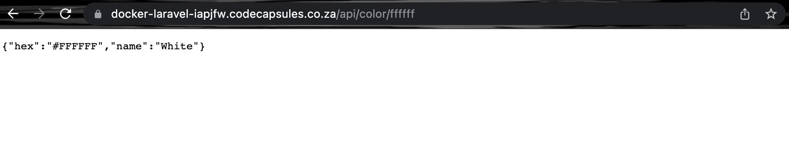

# Building a Hex Color Identifier API with PHP, Laravel, and Docker


Docker provides containers to run applications in isolation. Among other benefits of this architecture, one is allowing applications on the same server to run independently, reducing the likelihood of having a single point of failure in your project.

In this tutorial, we’ll build a hex color identifier API with PHP using the Laravel framework, containerize the application using Docker, then ship it to production on Code Capsules.

Here’s an example of a response we might get after querying the API.



## Requirements

You will need the following to complete the tutorial and host your application on Code Capsules:

- A [Code Capsules](https://codecapsules.io/) account.
- Git set up and installed, and a registered [GitHub](https://github.com/) account.
- IDE or text editor of your choice.
- PHP and composer installed.

## Project Set Up

To begin, we need to **create a project folder** to house all our files.

In a terminal, navigate to the directory you'll be keeping the application files in. Run the commands below to create the project folder and navigate into it.

```bash
mkdir color-identifier
cd color-identifier
```

### Create Laravel Project

From the project folder terminal, run the commands below to create a Laravel starter project called “ColorApi” and change directories into it.

```bash
composer create-project --prefer-dist laravel/laravel ColorApi
cd ColorApi
```

From now on the `ColorApi` folder will be referred to as the project root folder.

### Initialize an Empty Git Repository

From the project’s root folder, enter the command `git init` to initialize a git repository. This will allow you to track changes to your app as you build it.

### Linking to GitHub

Head over to [GitHub](https://github.com/) and create a new repository. Then, in your project's root folder, run the command below from the terminal, replacing "username" and "repository_name" with your own values from GitHub.

```bash
git remote add origin git@github.com:username/repository_name.git
```

This will link your local repository to the one on GitHub.

### Install Dependencies

Next, we'll install the dependencies we need to build our application. Open the `composer.json` file in the root folder and add the following entries to the `"require"` dictionary:

```json
"require": {
    ...

    "ourcodeworld/name-that-color": "dev-master",
    "symfony/console": "6.0.*",
    "symfony/error-handler": "6.0.*",
    "symfony/finder": "6.0.*",
    "symfony/http-foundation": "6.0.*",
    "symfony/http-kernel": "6.0.*",
    "symfony/mailer": "6.0.*",
    "symfony/mime": "6.0.*",
    "symfony/process": "6.0.*",
    "symfony/routing": "6.0.*",
    "symfony/var-dumper": "6.0.*",
    "symfony/event-dispatcher": "6.0.*",
    "symfony/string": "6.0.*",
    "symfony/translation": "6.0.*",
    "symfony/translation-contracts": "3.0.*",
    "symfony/service-contracts": "3.0.*",
    "symfony/event-dispatcher-contracts": "3.0.*",
    "symfony/deprecation-contracts": "3.0.*"

    ....
}
```

Now run the command `composer update` from the terminal to install the packages.

## Build Hex Color API

While in the `ColorApi` terminal, run the command below to create a controller for your API:

```bash
php artisan make:controller ColorController
```

This command will create a controller at `app/Http/Controllers/ColorController.php`. In big projects, controllers are meant to group similar request-handling logic in different methods, but the hex color API we’re building is relatively small and will only have one controller method.

Update the contents of `ColorController.php` so it looks like this:

```php
<?php

namespace App\Http\Controllers;

require base_path('vendor/autoload.php');

use Illuminate\Http\Request;
use ourcodeworld\NameThatColor\ColorInterpreter;

class ColorController extends Controller
{
    public function convert($hexcode)
    {
        $instance = new ColorInterpreter();

        $result = $instance->name($hexcode);

        return response()->json(["hex" => $result["hex"], "name" => $result["name"]], 200);
    }
}
```

We require the `autoload.php` module on line 5 to automatically load the dependency we installed earlier and can now reference it on line 8.

The `convert()` method is responsible for converting a hex code to a human-readable name by leveraging the `ColorInterpreter` package we loaded on line 8. It takes in the hex code as an argument and returns the color name.

### Create API Routes

With the controller in place, we’re left with linking it to a route that other applications or users can hit. Let’s create and link to this route by editing the `routes/api.php` file like this:

```php
<?php

use Illuminate\Http\Request;
use Illuminate\Support\Facades\Route;
use App\Http\Controllers\ColorController;

Route::middleware('auth:sanctum')->get('/user', function (Request $request) {
    return $request->user();
});
Route::get('/color/{hexcode}',[ColorController::class, 'convert']);
```

On the last line, we add a route that accepts GET requests with a hexcode parameter on the `api/color` URL. We then link that route to the `ColorController` class `convert()` method. Your application should be able to accept requests on the `api/color/{hexcode}` route now.

## Dockerize API

Our Laravel application can now run locally, but we need to install it in a Docker container for it to run on Code Capsules. To do this, add a `Dockerfile` to the `/ColorApi` folder. A `Dockerfile` is a set of instructions on how to build an image of your application and run it inside a docker container. Populate the `Dockerfile` with the code below:

```dockerfile
FROM composer:2.0 as build
COPY . /app/
RUN composer install --prefer-dist --no-dev --optimize-autoloader --no-interaction --ignore-platform-reqs

FROM php:8.1-apache-buster as production
RUN echo "ServerName 127.0.0.1" >> /etc/apache2/apache2.conf

ENV APP_ENV=production
ENV APP_DEBUG=false

RUN docker-php-ext-configure opcache --enable-opcache && \
    docker-php-ext-install pdo pdo_mysql

COPY --from=build /app /var/www/html

RUN php artisan config:cache && \
    php artisan route:cache && \
    chmod 777 -R /var/www/html/storage/ && \
    chown -R www-data:www-data /var/www/

CMD ["php", "artisan", "serve", "--host=0.0.0.0"]
```

### Naming the `Dockerfile`

The name `Dockerfile` should start with a capital letter ‘D’ and have no extension, otherwise it won’t work.

### Understanding the `Dockerfile`

Let’s take a look at how the image is built and run in the `Dockerfile`.

In the first three lines, we require `composer` as the build stage and copy the project to the `/app` folder of the container. After copying all the `src` code for our app into the container, we run `composer install` with some optional parameters that create an efficient production build.

After installing the dependencies, we require PHP 8.1 as the production stage and set the `"ServerName"` variable to avoid getting a warning from the apache server. We then copy the app from the build stage into the production stage, specifically into the `/var/www/html` directory.

The last command tells Docker how to run your application after it has been built.

## Add, Commit, and Push Git Changes

Our application is now ready for deployment. Let's add and commit all the files we created to our local repository and then push them to the remote one. Do this by running the commands listed below in a terminal while in the project’s root folder:

```bash
git add -A
git commit -m "Added hex color identifier app files"
git branch -M main
git push -u origin main
```

Your remote repository will now be up to date with your local one.

## Deploy to Code Capsules

The final step is to deploy our app. Log into your Code Capsules account and link your remote GitHub repository to Code Capsules. Create a Docker Capsule and deploy the app there. You can reference this [deployment guide](https://codecapsules.io/docs/deployment/how-to-deploy-flask-docker-application-to-production/#create-the-capsule) to see how to do so in greater detail.

Once the build is complete, navigate to the "Configure" tab and scroll down to the "Network Port" section. Enter "8000" as the port number and click on "Update Capsule".


That’s it! Your "Hex Color Identifier" app should be live and fully functional now. You should now be able to query the `/api/color` route.


