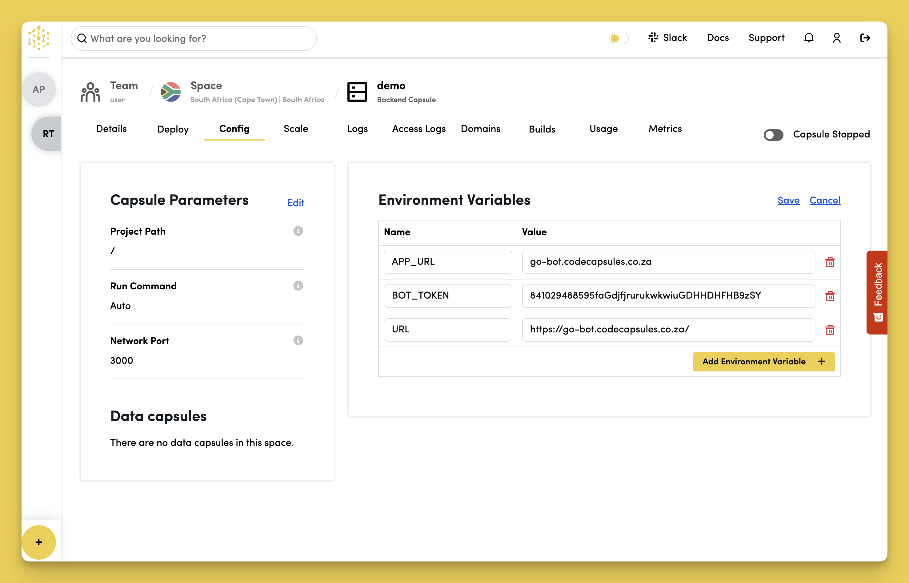

# Go Telegram Bot

Deploy a Go Telegram Bot and learn how to host backend code on Code Capsules.

## Register the Bot

Before you can create a Telegram bot, you need a Telegram user account. Open Telegram and create an account if you don't already have one.

When you've signed in to Telegram, search for "BotFather" (a bot for managing all other Telegram bots) and start a new chat with it.

Follow the steps below to register a new bot with the BotFather:

1. Type `/start` and press send.
2. Type `/newbot` and press send.
3. Choose a name for your bot.
4. Choose a username for your bot that ends in "bot".

The BotFather will respond with a message containing an access token for your newly created bot. This access token allows our application to:

- Access the Telegram API.
- Tell our bot what to do when receiving different messages from users.

To confirm that your bot has been created successfully, search for the bot's username. You should be able to see it and start a conversation with it. However, it won't respond because we haven't written the bot's logic yet.

## Setup

Code Capsules connects to GitHub repositories to deploy applications. To follow this guide, you need a [Code Capsules](https://codecapsules.io/) account and a [GitHub](https://github.com/) account.

To demonstrate how to deploy a Go Telegram Bot with Code Capsules, we've provided an example bot in the [Code Capsules GitHub repository](https://github.com/codecapsules-io/go-telegram-echobot).

Sign in to GitHub, and fork the example bot repository by clicking "Fork" at the top right of your screen and selecting your GitHub account as the destination.

## Create a Space for Your Bot

Log in to your Code Capsules account and navigate to the "Spaces" tab. Then, click the yellow `+` icon at the bottom left of the screen to add a new Space.

Follow the prompts to choose your region and give your Space a name, then click "Create Space".

.png>)

Example instructions to go with numbered annotations:

1. Choose a Team. You can use a default "personal" Team if you're the only person working on this project, or a named Team if you're collaborating with others.
2. This should remind you of the project, for example, "customer-api" or "notetaking-app".
3. Choose a country close to where most of your users reside.

## Create the Capsule

A [Capsule](https://docs.codecapsules.io/platform/capsules/what-is-a-capsule) provides the server for hosting an application on Code Capsules.

To create a new Capsule for your Space, follow the instructions below:

1. Click the add Capsule `+` button in your Space.
2. Choose "Backend" for the Capsule type, and select your Team and Space, if not already populated.
3. Choose your payment plan and click "Next".
4. Click the "Configure Git for Code Capsules" button and grant access to your forked `go-telegram-echobot` repository.
5. Press "Next".
6. Leave the "Run Command" blank.
7. Click "Create Capsule".

Code Capsules automatically builds your application when you've finished creating the Capsule.

Once your application is live, you can view the build logs by selecting the "Deploy" tab and clicking the "View build log" link in the "Builds" section.

.png>)

## Add Environment Variables

Once the build is complete, we need to add the `BOT_TOKEN` and `URL` environment variables on the "Config" tab, under the "Environment Variables" section.

First, name the `BOT_TOKEN` variable and enter your Telegram access token (which you received from the BotFather when you registered the bot) as its "Value".

Name the `URL` variable and set your bot's domain as its "Value".

- Get the domain by clicking the Capsule's "Details" tab and copying the URL in the **Public URL** section.
- Paste the URL in the "Value" field.
- Make sure the URL ends with a `/` or the webhook will not be valid.

Confirm your changes by clicking on "Save", then restart your Capsule by toggling the radio button in the top-right corner off and on again.

## Set Up Webhook

The next step is to set up a webhook for your bot:

- Click the "Public URL" link in your Capsule's "Details" tab.
- In the new tab that opens, add `/setwebhook` to the URL and press `enter`/`return` to visit the URL.
- If you see `webhook setup ok`, then your bot is ready to chat!

## Chat with the Bot

The bot can now respond to messages! Search for your bot on Telegram using the username you assigned it, and start a chat with it. The bot is programmed to respond to `/start` and echo any messages you send it.

If you'd like to deploy another application in a different language or framework, take a look at our other [deployment guides](https://docs.codecapsules.io/backend).
