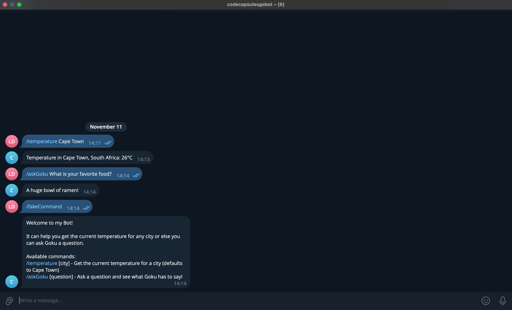
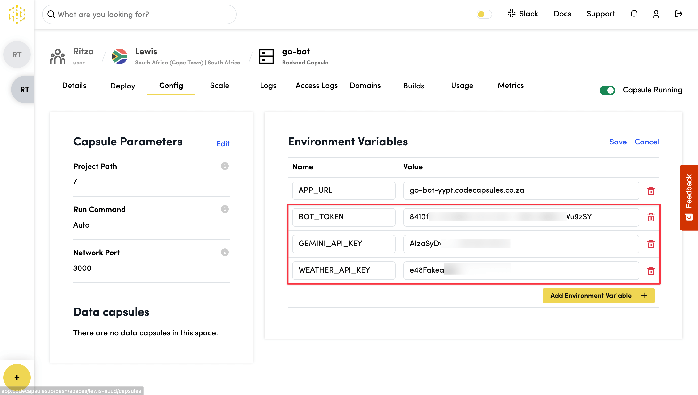

# How to Create and Host a Go Telegram Bot on Code Capsules

_This guide uses Go. You can find the Node.js version_ [_here_](https://docs.codecapsules.io/tutorials/create-and-host-a-telegram-bot-with-node.js-on-code-capsules) _or the Python version_ [_here_](https://docs.codecapsules.io/tutorials/how-to-create-and-host-a-telegram-bot-on-code-capsules).

In this tutorial we'll create a [Telegram bot](https://core.telegram.org/bots/) from scratch using [Go](https://go.dev/) and host it in a [new Capsule](https://app.codecapsules.io/new/capsule?capsuleType=backend). The bot will start with the basic functionality of checking the current air temperature of a given city. Then, we'll extend its functionality by adding AI capabilities using Google AI Studio.

### Getting Started

For this project we will use the following tech stack:

* **Frontend**: A Telegram bot that accepts specific commands from users.
* **Backend**: An application written in Go and supported by various third-party APIs.

The rest of the stack will be handled by our Backend Capsule.

Create a Code Capsules account [here](https://codecapsules.io/) if you don't already have one.

We will host our code on GitHub, so make sure you have a [GitHub account](https://github.com/signup) and are familiar with [Git](https://git-scm.com/). You can find a guide to getting started with Git [here](https://git-scm.com/book/en/v2/Getting-Started-About-Version-Control).

#### **Create a Telegram Account**

Go to [Telegram](https://telegram.org/), download the app for your desired platform, and create an account.

For development purposes, we recommend downloading the version suited to your development environment, but it will work fine on your phone.

#### **Install Go**

If you have Homebrew configured, you can run the following code to install Go in a single step:

```bash
brew install go
```

Alternatively, you can find the appropriate instructions for your OS [here](https://go.dev/doc/install).

Ensure that Go is installed correctly by checking that the version is displayed when you run `go version`.

Start a project by creating a new directory for local development:

```bash
mkdir go-bot && cd go-bot
```

#### **Set Up Third-Party APIs**

We will make use of APIs from Weatherstack and Google AI Studio.

Weatherstack provides weather data with 100 free requests per month. To obtain a Weatherstack API key:

* Create a free [account](https://weatherstack.com/product).
* Log in and take note of the API key presented in the control panel.

Google AI Studio provides access to generative AI models with a free tier for API calls. To obtain a Google AI Studio API key:

* Go to [Google AI Studio](https://aistudio.google.com/).
* Sign in with your Google account.
* Click on **Get API key** and select **Create API key in new project**.
* Copy the generated API key and store it securely.

### Register a Bot Account and Talk to the BotFather

Once you've signed in to Telegram, search for "BotFather" (a bot for managing all other Telegram bots) and start a new chat. Follow the steps below to register a new bot with the BotFather:

1. Type `/start` and press send.
2. Type `/newbot` and press send.
3. Choose a name for your bot.
4. Choose a username for your bot that ends in `bot`.

The BotFather will respond with a message containing an access token for your newly created bot. This access token will allow your application to access the Telegram Bot API and tell your bot what to do when receiving different messages from users.

To confirm that your bot was created successfully, search for the bot's username. You should be able to see it and start a conversation with it, although it won't respond at this stage as we haven't written the bot's logic yet.

### Install Required Packages

Our bot requires four third-party Go packages to handle Telegram communication, HTTP requests, environment variables, and AI integration. We'll install these using Go's package manager.

First, initialize a Go module for your project by running the following command in your `go-bot` directory:

```bash
go mod init example.com/go-bot
```

Then install each of the required packages:

```bash
go get github.com/go-telegram-bot-api/telegram-bot-api/v5

go get github.com/go-resty/resty/v2

go get github.com/joho/godotenv

go get google.golang.org/genai
```

After running all four commands, Go will automatically download and install each package, and your `go.mod` file will be updated with the dependencies.

### Set Up the Environment

Create a `.env` file in your `go-bot` directory to store your API keys securely.

```bash
touch .env
```

Add the following environment variables and replace the placeholder values with your actual API keys:

```
BOT_TOKEN=YOUR_TELEGRAM_BOT_TOKEN
WEATHER_API_KEY=YOUR_WEATHERSTACK_API_KEY
GEMINI_API_KEY=YOUR_GOOGLE_GEMINI_API_KEY
```

The godotenv package will automatically load these variables when the bot starts, making them available through `os.Getenv()`.

### Create the Bot

Create a new file `bot.go`. This will contain all the code for your bot's backend.

Go requires a package and a function named `main` in order to execute. Specify that the new `bot.go` file is your main package.

```go
package main
```

#### **Imports**

Now we can add imports for the third-party packages. We'll also need the functionality in some of the default packages that are shipped with Go.

```go
import (
    "context"
    "fmt"
    "log"
    "os"
    "strings"
    
    "github.com/go-resty/resty/v2"
    tgbotapi "github.com/go-telegram-bot-api/telegram-bot-api/v5"
    "github.com/joho/godotenv"
    "google.golang.org/genai"
)
```

#### **Helper Functions**

Before we build out the `main()` function, which will control most of the logic to handle the bot commands, we need to build two helper functions that will make the calls to the third-party APIs.

The first helper function retrieves temperature data from the Weatherstack API.

First, we define a struct that maps the JSON response from Weatherstack:

```go
type TemperatureResponse struct {
    Current struct {
        Temperature int `json:"temperature"`
    } `json:"current"`
    Location struct {
        Name    string `json:"name"`
        Country string `json:"country"`
    } `json:"location"`
}
```

This struct tells Go how to parse the API's JSON response by matching the fields we need.

Then we create the `getTemperature` function, which takes a city name and queries the Weatherstack API:

```go
func getTemperature(city string) (string, error) {
    apiKey := os.Getenv("WEATHER_API_KEY")
    if apiKey == "" {
        return "", fmt.Errorf("WEATHER_API_KEY environment variable not set")
    }
    
    client := resty.New()
    
    url := fmt.Sprintf("http://api.weatherstack.com/current?access_key=%s&query=%s", apiKey, city)
    resp, err := client.R().SetResult(&TemperatureResponse{}).Get(url)
    if err != nil {
        return "", err
    }
    
    if resp.StatusCode() != 200 {
        return "", fmt.Errorf("API returned status %d", resp.StatusCode())
    }
    
    result := resp.Result().(*TemperatureResponse)
    
    if result.Location.Name == "" {
        return "", fmt.Errorf("could not find location data in API response")
    }
    
    return fmt.Sprintf("Temperature in %s, %s: %d°C", result.Location.Name, result.Location.Country, result.Current.Temperature), nil
}
```

The function starts by retrieving the API key from our environment variables. We create a new Resty client to make HTTP requests, and then build the API URL with our key and the requested city. The `SetResult()` method tells Resty to parse the response into our `TemperatureResponse` struct. We can then check that the request succeeded, verify that the location data exists, and return a formatted string with the temperature information.

For a more interesting example, the second helper function sends user questions to Google's Gemini API and return responses in whichever style we prompt it to use. In this case, we'll use Goku from Dragon Ball Z.

```go
func askGoku(question string) (string, error) {

    const prompt = "You are Goku from DragonballZ. Give a very brief reply with no fluff. Always speak in the style of Goku."
```

To make the LLM respond in the style of Goku, we define a [system prompt](https://www.promptlayer.com/glossary/system-prompt) and attach it to the end of every user message so it will always be the final instruction to the LLM.

From there, all we have to do is send our question to our Google AI Studio API instance and return the generated response to the user.

```go
    apiKey := os.Getenv("GEMINI_API_KEY")
    if apiKey == "" {
        return "", fmt.Errorf("GEMINI_API_KEY environment variable not set")
    }
    
    ctx := context.Background()
    
    client, clientErr := genai.NewClient(ctx, &genai.ClientConfig{
        APIKey: apiKey,
    })
    if clientErr != nil {
        return "", fmt.Errorf("failed to create Gemini client: %v", clientErr)
    }
    
    result, err := client.Models.GenerateContent(
        ctx,
        "gemini-2.5-flash",
        genai.Text(question+" "+prompt), // add the system prompt
        nil,
    )
    if err != nil {
        return "", fmt.Errorf("failed to generate content: %v", err)
    }
    
    if result == nil {
        return "", fmt.Errorf("received nil response from Gemini API")
    }
    
    if result.Text() == "" {
        return "", fmt.Errorf("received empty response from Gemini API")
    }
    
    response := result.Text()
    if len(response) > 4096 {
        response = response[:4093] + "..."
    }
    
    return response, nil
}
```

For some basic error handling, we validate that we received a non-empty response and then check if it exceeds Telegram's message length limit (4096 characters).

#### **Main Function**

We can now begin to build our `main()` function. We need our code to be aware of the environment variables that we set up in our `.env` file. We're using this file for convenience so that we can run the bot locally. Once our code is deployed, we'll configure the environment variables on our server instead.

```go
func main() {

    if err := godotenv.Load(); err != nil {
        log.Printf("Warning: Could not load .env file: %v", err)
    }
```

Now that the variables are loaded into our environment, we can access them with the `os.Getenv()` function to get our `BOT_TOKEN`, and then we can create a new instance of the Telegram BotAPI.

```go
    token := os.Getenv("BOT_TOKEN")
    if token == "" {
        log.Fatal("BOT_TOKEN environment variable not set")
    }
    
    bot, err := tgbotapi.NewBotAPI(token)
    if err != nil {
        log.Panic(err)
    }
```

#### **Get Messages**

The next step is to enable our backend to respond whenever a user sends a command. Luckily, the Telegram Bot API package offers several ready solutions. The simplest approach is to use polling, in which the backend code continuously queries the bot API to check for new messages.

```go
    u := tgbotapi.NewUpdate(0)
    u.Timeout = 60
    
    // Get the updates channel from the bot
    updates := bot.GetUpdatesChan(u)
```

The above code handles this setup. It uses the `GetUpdatesChan()` function to launch a background [goroutine](https://go.dev/tour/concurrency/1) that polls the Telegram Bot API for new message requests. As soon as a message arrives, it is assigned to the `updates` variable and the rest of the code continues to run.

Now that we have polling inplace, we can set up the main loop of our program that will process the user commands when they are available.

```go
    for update := range updates {
```

Go handles the above code quite efficiently, as the loop will sleep until a value is available on the updates channel, instead of running continuouslt and using CPU cycles.

Next, we add a check to skip any kind of update we receive that doesn't contain an actual message string. Once we are sure there is a message, we can extract the `Message` object.

```go
        if update.Message == nil {
            continue
        }
        
        msg := update.Message
```

#### **Process Commands**

Now that we know we have a message from the user, we can add the logic for the commands that we want to support. To make the code easier to follow, we'll keep all the logic in the main class. If you are coding a more complex bot, with support for a large number of commands, you would probably want to consider improving the extendibility of your code with some object-oriented principles. For example, this code would be suited to the [Factory Method pattern](https://refactoring.guru/design-patterns/factory-method), which could provide some layers of abstraction that make adding new commands more streamlined.

First, let's look at the temperature command `/temperature [city]`. This will make a call to the Weatherstack API to get the live temperature for the provided city.

```go
        if strings.HasPrefix(msg.Text, "/temperature") {
            city := "Cape+Town"
            parts := strings.Fields(msg.Text)
            if len(parts) > 1 {
                city = strings.Join(parts[1:], "+")
            }
```

We extract the actual text string from the `Message` object and then check if it starts with our supported command.

If any more text appears after the command string, we treat all of it as the city name. Since the Weatherstack API requires multi-word city names to be separated by `+`, we split the rest of the string into parts and then join them back together using `+` symbols.

Now that our city name is in the correct format required by the `getTemperature(city)` helper method, we simply call it and return the result to the user.

```go
            temperature, err := getTemperature(city)
            if err != nil {
                log.Print(err)
                reply := tgbotapi.NewMessage(msg.Chat.ID, "Sorry, I couldn't fetch the temperature for "+city)
                bot.Send(reply)
                continue
            }
    
            reply := tgbotapi.NewMessage(msg.Chat.ID, temperature)
            bot.Send(reply)
```

One thing to note is error handling. For good UX and security best practices, it is generally best not to send raw error messages to users. Instead, log the real error internally and return a generic error message to the user.

Next, we'll work on the `/askGoku` command.

```go
        } else if strings.HasPrefix(msg.Text, "/askGoku") {
            parts := strings.SplitN(msg.Text, " ", 2)
            if len(parts) < 2 {
                reply := tgbotapi.NewMessage(msg.Chat.ID, "Please provide a question. Usage: /askGoku [question]")
                bot.Send(reply)
                continue
            }
```

tart by checking if the message begins with `/askGoku`. Then, use `strings.SplitN()` to split the message into at most two parts. This ensures that questions with multiple words are kept together. If the user did not provide a question after the command, we send them an error message with usage instructions and `continue` to the next update.

Now we can call our `askGoku()` helper function. If the request succeeds, we create a new message with the AI response and send it back to the user.

```go
            response, err := askGoku(parts[1])
            if err != nil {
                log.Print(err)
                reply := tgbotapi.NewMessage(msg.Chat.ID, "Sorry, I couldn't process your question. Please try again.")
                bot.Send(reply)
                continue
            }
            
            reply := tgbotapi.NewMessage(msg.Chat.ID, response)
            bot.Send(reply)
```

#### **Default Response**

The last thing we need to do is add a default response if the user sends anything other than the commands that we support.

```go
        } else {
            reply := tgbotapi.NewMessage(msg.Chat.ID, "Welcome to my Bot!\n\nIt can help you get the current temperature for any city or else you can ask Goku a question.\n\nAvailable commands:\n/temperature [city] - Get the current temperature for a city (defaults to Cape Town)\n/askGoku [question] - Ask a question and see what Goku has to say!")
            bot.Send(reply)
        }
    }
}
```

We can use this default case to show the expected usage for our supported commands.

### Test the Bot Locally

Before deploying to Code Capsules, test that your bot works correctly. You can run it locally using the polling approach.

```bash
go run bot.go
```

Open Telegram, find your bot by username, and test the commands:

* Send `/temperature Cape Town` to check the current temperature.
* Send `/askGoku What is your favorite food?` to get a response from Goku.
* Send any other text to see the welcome message.



Check your terminal for any error logs if something doesn't work. Once you've verified that all commands work as expected, you're ready to deploy.

### Deploy the Bot

We will now deploy the bot on Code Capsules and make it more efficient by using webhooks instead of polling.

Follow [this quick guide](https://docs.codecapsules.io/backend/go) to set up your Code Capsules account and create a new Capsule.

Once it is up and running, navigate to the **Config** tab of your Capsule and add a `BOT_TOKEN` environment variable, giving it the value of your bot's access token. Similarly, add your `WEATHER_API_KEY` and `GEMINI_API_KEY`.



Commit your bot code and push to your GitHub repository. Then, in the **Deploy** tab, find **Capsule Branch** and click **Edit**. Select your new repository from the drop down menu (if it doesn't show up, select **Configure Git for Code Capsules** and follow the steps) and click **Save**. This will trigger a new build of the project and the bot will go live.


We can then run the same tests as we ran locally (ensure the local instance is stopped) to check that the bot is still working as intended.

### Polling vs Webhooks

The polling approach we used earlier works well for development and small bots. However, polling is not the most bandwidth-efficient method because it requires constant communication between the backend code and the server.

A more efficient alternative is webhooks, which work in the reverse manner. Instead of the bot repeatedly asking Telegram for updates, Telegram will send updates directly to the bot's HTTP server whenever a user sends a message.

#### **How to Convert to Webhooks**

The main architectural change is replacing the polling loop with an HTTP server. Instead of this:

```go
u := tgbotapi.NewUpdate(0)
u.Timeout = 60
updates := bot.GetUpdatesChan(u)

for update := range updates {
    // process update
}
```

Create an HTTP server that listens for POST requests from Telegram:

```go
http.HandleFunc("/", handleWebhook)
log.Fatal(http.ListenAndServe(":"+port, nil))
```

When the bot starts, we need to tell Telegram where to send updates. This is done with the `NewWebhook()` function:

```go
webhookURL := os.Getenv("APP_URL")
if webhookURL == "" {
    log.Fatal("APP_URL environment variable not set")
}

wh, err := tgbotapi.NewWebhook(webhookURL)
if err != nil {
    log.Panic(err)
}
if _, err := bot.Request(wh); err != nil {
    log.Panic(err)
}
```

The `APP_URL` is the public URL where Telegram can reach our bot. This will be automatically configured in the Capsule.

#### **Receiving and Processing Webhook Updates**

The HTTP handler receives JSON from Telegram and unmarshals it into an `Update` struct:

```go
func handleWebhook(w http.ResponseWriter, r *http.Request) {
    if r.Method != http.MethodPost {
        w.WriteHeader(http.StatusMethodNotAllowed)
        return
    }

    body, err := io.ReadAll(r.Body)
    if err != nil {
        log.Printf("Error reading request body: %v", err)
        w.WriteHeader(http.StatusBadRequest)
        return
    }

    var update tgbotapi.Update
    if err = json.Unmarshal(body, &update); err != nil {
        log.Printf("Error unmarshaling update: %v", err)
        w.WriteHeader(http.StatusBadRequest)
        return
    }

    go processUpdate(update)
    w.WriteHeader(http.StatusOK)
}
```

The handler immediately returns an HTTP 200 OK response to Telegram. The actual processing of the update happens asynchronously in a goroutine with `go processUpdate(update)`. This ensures that Telegram doesn't timeout waiting for the bot to process the command.

The `processUpdate()` function contains the same command handling logic as before (temperature, askGoku, etc.), but it's now called for each webhook update instead of being in a polling loop.

Now you can simply push the code to your GitHub repo, and your Code Capsules instance will automatically rebuild and deploy the changes to production.
