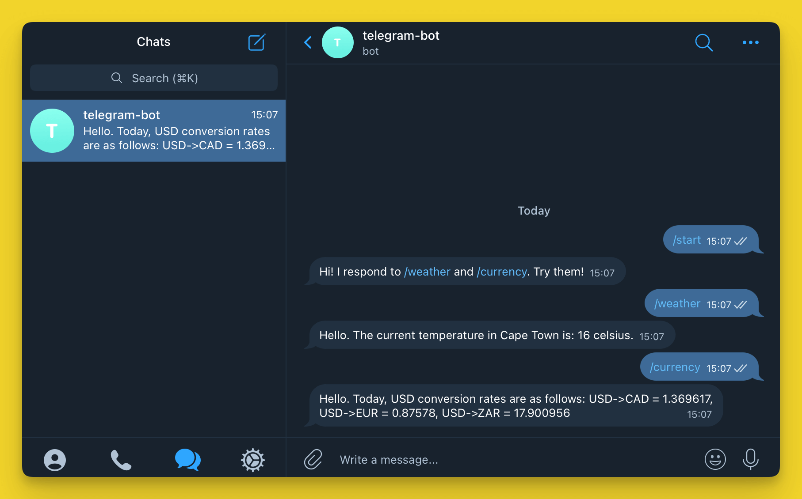
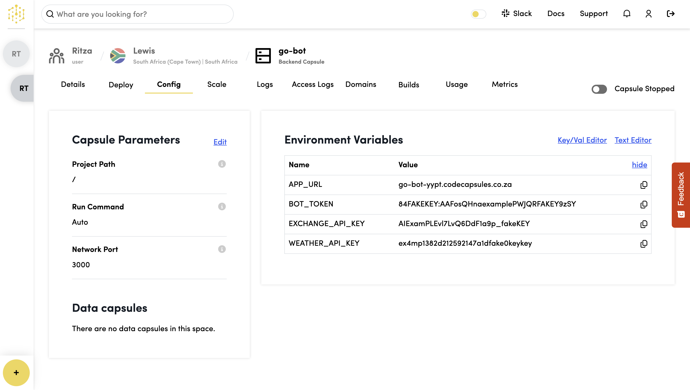

# How To Create and Host a Telegram Bot on Code Capsules

_This guide uses Python. You can find the Node.js version_ [_here_](https://docs.codecapsules.io/tutorials/create-and-host-a-telegram-bot-with-node.js-on-code-capsules)_, and the Go version [_here_](https://docs.codecapsules.io/tutorials/create-and-host-go-ai-telegram-bot)._

In this tutorial, we'll create a Telegram bot that will allow us to pull temperature, weather, and exchange rate data on the go by messaging our bot in the Telegram app.

We'll also learn how to host this bot on [Code Capsules](https://codecapsules.io/) so it can be used by others. Along the way, we'll learn some key concepts about hosting bots securely and efficiently.

### Requirements

To create a Telegram bot, we'll need:

* [Python](https://www.python.org/) 3.9+ installed.
* A [GitHub account](https://github.com/) and [Git](https://git-scm.com/) installed.
* [Virtualenv](https://pypi.org/project/virtualenv/) installed.
* A [Code Capsules](https://codecapsules.io/) account.

### About Telegram Bots

Telegram bots appear as contacts on the Telegram interface. Users interact with Telegram bots by messaging them with commands – these are words preceded by a forward slash, such as `/weather` or `/currency`. Commands sent to the bot's account on Telegram are passed to the bot's backend code (in our case, this will be the code we host on Code Capsules).

For example, when we send the command `/weather` to our bot later in this article, the bot will reply with the weather data from our personal API.

Let's create a Telegram bot.

### Registering a Bot Account and Talking to the BotFather

To create a Telegram bot, we need to download [Telegram](https://telegram.org/) and create a user account. You can use Telegram on your PC, your phone, or both.

Once you have a Telegram account, you can register a new bot by sending a message to BotFather, a bot managed by Telegram itself. Search for `BotFather` and initiate a chat. From the chat interface, follow these steps:

1. Click **Start**.
2. Type `/newbot`.
3. Choose a name for your bot.
4. Choose a username for your bot (must end in `bot`).

Once you've chosen a username, the BotFather will reply with an _authorization token_. This is a string that enables your bot to send requests to the Telegram Bot API. Make sure to save this token somewhere safe and private.

To check whether your bot was successfully created, search for the bot's username. You should see the bot and be able to start a conversation with it. Right now, your bot won't reply to anything you send it, as it doesn't have any backend code yet. Let's change that.

### Planning and Setup

We're going to implement two commands for our bot.

* When we send the command `/weather`, our bot will reply with the weather data from the weather API.
* When we send the command `/currency`, our bot will reply with the exchange rates for converting USD to CAD, EUR, and ZAR.

#### Creating a Virtual Environment and Installing Requirements

First, we need to create a local directory. Give it the same name as the bot. Then, from this directory, open a terminal and create a Python [virtual environment](https://docs.python.org/3/tutorial/venv.html) by entering the following command:

```bash
python -m venv venv
```

Activate the virtual environment using the appropriate command for your system:

* **Linux/macOS**: `source venv/bin/activate`
* **Windows**: `venv\Scripts\activate.bat`

The virtual environment will help manage our dependencies when we host the bot on Code Capsules.

To interact with the Telegram Bot API, we need to install the [python-telegram-bot](https://github.com/python-telegram-bot/python-telegram-bot) library, a Python wrapper for the [Telegram Bot API](https://core.telegram.org/bots/api). We'll also use the Python library `requests` to retrieve data from the weather and currency exchange rate API. Finally, we will install the `python-dotenv` library for convenience, so that we can store our sensitive API keys in a file while we test locally. To install these requirements, enter the following in your terminal:

```bash
pip install python-telegram-bot requests python-dotenv
```

### Registering Accounts on OpenExchangeRates and Weatherstack

Our bot will return the current temperature of a chosen city and the USD exchange rates for three currencies. We'll create our response by combining data from two APIs: Weatherstack and OpenExchangeRates.

#### Getting Our API Keys

In the directory where we'll create our bot (the same directory where we activated our virtual environment), create a file called `.env`. We'll use this to store our API keys temporarily while we code and test.

First, let's register an account on OpenExchangeRates. Navigate [to the site](https://openexchangerates.org/) and:

1. Sign up and log in.
2. On the dashboard, click **App IDs**.
3. Take note of your **App ID** (API key), and paste it in the `.env` file: `EXCHANGE_API_KEY=<YOUR_API_KEY>`.

Obtaining the Weatherstack API key is similar:

1. Create a free account on [Weatherstack](https://weatherstack.com/)
2. Log in, copy the API key displayed in the control panel, and paste it into the `.env` file: `WEATHER_API_KEY=<YOUR_API_KEY>`.

At this point, we can also add the _authorization token_ for the Telegram bot we created earlier to the `.env` file: `BOT_TOKEN=<YOUR_BOT_TOKEN>`.

### Creating the Bot

Now we can start coding. Create a file named `bot.py` in the same directory as your `.env` file. We'll set up helper functions to fetch data from the weather and exchange rate APIs. In this file, enter the following code:

```python
import os
import requests
from dotenv import load_dotenv

load_dotenv()

EXCHANGE_API_KEY = os.getenv('EXCHANGE_API_KEY')
WEATHER_API_KEY = os.getenv('WEATHER_API_KEY')

EXCHANGE_URL = f'https://openexchangerates.org/api/latest.json?app_id={EXCHANGE_API_KEY}'
EXCHANGE_PARAMS = {'symbols': 'ZAR,EUR,CAD'}

WEATHER_URL = f'http://api.weatherstack.com/current?access_key={WEATHER_API_KEY}'
WEATHER_PARAMS = {'query': 'Cape Town'}

def get_weather():
    response = requests.get(WEATHER_URL, params=WEATHER_PARAMS)
    curr_temp = response.json()['current']['temperature']
    return f'Hello. The current temperature in Cape Town is: {curr_temp} celsius.'

def get_exchange_rates():
    response = requests.get(EXCHANGE_URL, params=EXCHANGE_PARAMS)
    rates = response.json()['rates']
    cad_rate, eur_rate, zar_rate = rates['CAD'], rates['EUR'], rates['ZAR']
    return f'Hello. Today, USD conversion rates are as follows: USD->CAD = {cad_rate}, USD->EUR = {eur_rate}, USD->ZAR = {zar_rate}'
```

We've created two helper functions: `get_weather()` and `get_exchange_rates()`. These functions make requests to the third-party APIs and then format the JSON response into a string that the bot can send back to users. The `load_dotenv()` call above loads the variables from our `.env` as environment variables.

### Creating the Bot

Now we can get to creating the actual bot. At the top of the `bot.py` file, add this line:

```python
from telegram.ext import Application, CommandHandler
```

From the `python-telegram-bot` library, we import two classes: `Application` and `CommandHandler`. Now we can create our `main()` method like this:


```python
def main():
    TOKEN = os.getenv('BOT_TOKEN')
    application = Application.builder().token(TOKEN).build()

    weather_handler = CommandHandler("weather", weather)
    currency_handler = CommandHandler("currency", currency)
    start_handler = CommandHandler("start", start)

    application.add_handler(weather_handler)
    application.add_handler(currency_handler)
    application.add_handler(start_handler)

    application.run_polling()

if __name__ == '__main__':
    main()
```

At the top of our new `main` method, which will be called when this file is run, we instantiate `application`, an instance of the Telegram library's [`Application`](https://docs.python-telegram-bot.org/en/stable/telegram.ext.application.html) class. This object will retrieve commands sent to our bot and handle them using the appropriate handlers we define.

Next, we create three different `CommandHandler` classes, one for each command that can be sent to our bot: `/start`, `/weather`, and `/currency`. We pass two arguments into each instantiation: the command text (without the preceding `/`) and a function to call. For example, when a user enters the command `/weather`, the `weather()` function will be called.

Let's define these functions. Just above `def main()`, enter the following three function definitions:

```python
async def weather(update, context):
    await context.bot.send_message(chat_id=update.effective_chat.id, text=get_weather())

async def currency(update, context):
    await context.bot.send_message(chat_id=update.effective_chat.id, text=get_exchange_rates())

async def start(update, context):
    await context.bot.send_message(chat_id=update.effective_chat.id, text="Hi! I respond to /weather and /currency. Try them!")
```

Each function calls the `python-telegram-bot` function `send_message()` with the ID of the current chat and the appropriate text, either returned from one of our other functions or specified as a string. Note that these functions are now `async` and use `await` when calling bot methods - this is required in the newer version of the library. The `update` and `context` arguments are supplied automatically by the application.

Back in our `main()` function, we use `application.add_handler` to add all three handlers to our application.

Finally, `application.run_polling()` will begin [_polling_](https://en.wikipedia.org/wiki/Polling_\(computer_science\)) for updates from Telegram. This means our code will regularly ask Telegram's servers whether any commands have been sent to it. Upon receiving commands, the appropriate handler will be invoked.

The code `bot.py` file should now look like the code below. Make sure you add your API keys to the `.env` file in the same directory.

```python
import os
import requests
from telegram.ext import Application, CommandHandler
from dotenv import load_dotenv

load_dotenv()

EXCHANGE_API_KEY = os.getenv('EXCHANGE_API_KEY')
WEATHER_API_KEY = os.getenv('WEATHER_API_KEY')

EXCHANGE_URL = f'https://openexchangerates.org/api/latest.json?app_id={EXCHANGE_API_KEY}'
EXCHANGE_PARAMS = {'symbols': 'ZAR,EUR,CAD'}

WEATHER_URL = f'http://api.weatherstack.com/current?access_key={WEATHER_API_KEY}'
WEATHER_PARAMS = {'query': 'Cape Town'}


def get_weather():
    """Fetch current weather from external API"""
    response = requests.get(WEATHER_URL, params=WEATHER_PARAMS)
    curr_temp = response.json()['current']['temperature']
    return f'Hello. The current temperature in Cape Town is: {curr_temp} celsius.'


def get_exchange_rates():
    """Fetch exchange rates from external API"""
    response = requests.get(EXCHANGE_URL, params=EXCHANGE_PARAMS)
    rates = response.json()['rates']
    cad_rate, eur_rate, zar_rate = rates['CAD'], rates['EUR'], rates['ZAR']
    return f'Hello. Today, USD conversion rates are as follows: USD->CAD = {cad_rate}, USD->EUR = {eur_rate}, USD->ZAR = {zar_rate}'


async def weather(update, context):
    await context.bot.send_message(chat_id=update.effective_chat.id, text=get_weather())


async def currency(update, context):
    await context.bot.send_message(chat_id=update.effective_chat.id, text=get_exchange_rates())


async def start(update, context):
    await context.bot.send_message(chat_id=update.effective_chat.id, text='Hi! I respond to /weather and /currency. Try them!')


def main():
    TOKEN = os.getenv('BOT_TOKEN')
    application = Application.builder().token(TOKEN).build()

    weather_handler = CommandHandler('weather', weather)
    currency_handler = CommandHandler('currency', currency)
    start_handler = CommandHandler('start', start)

    application.add_handler(weather_handler)
    application.add_handler(currency_handler)
    application.add_handler(start_handler)

    application.run_polling()


if __name__ == '__main__':
    main()
```

Below is a conversation with a bot created using this program. Run `bot.py` and try it out yourself.

<figure><figcaption><p>Telegram Bot Conversation</p></figcaption></figure>

We won't be able to send messages to our bot if this program isn't running, so hosting it on Code Capsules will allow us to interact with the bot without having to keep this code permanently running on our development PC.

While we could deploy our bot to Code Capsules in its current state, there is a downside to our current implementation that we should remedy first.

### Polling Versus Webhooks

There are two ways for our `bot.py` file to receive commands that have been sent to it on Telegram. Currently, the code polls Telegram constantly, regardless of whether the bot is in use. If we hosted this current version on Code Capsules, we would waste bandwidth, because the vast majority of polls would return nothing.

Instead of polling Telegram for changes, we can create a [_webhook_](https://en.wikipedia.org/wiki/Webhook). This will allow us to receive commands as they are sent by Telegram users, without having to continuously ask Telegram servers for them.

We'll set up a webhook by telling Telegram to send commands sent to our bot account to our bot's Code Capsules URL. Our application will then process the command using the appropriate handler and send back the requested information.

#### Creating a Webhook

To set up the webhook, replace the line `application.run_polling()` in the `main` function with the following code:

```python
    PORT = int(os.environ.get('PORT', '443'))
    HOOK_URL = f"https://{os.getenv('APP_URL')}/{TOKEN}"
    application.run_webhook(listen='0.0.0.0', port=PORT, url_path=TOKEN, webhook_url=HOOK_URL)
```

The `APP_URL` environment variable will be automatically set when the Capsule finishes building on Code Capsules.

And install Telegram webhooks:

```
pip install "python-telegram-bot[webhooks]"
```

Here we start a webhook that will listen on our Code Capsules URL at TCP port 443 and with the path of our token. Thus, Telegram will relay commands sent to our bot to the following URL:

```
https://YOUR-CAPSULE-PUBLIC-URL/TOKEN
```

If you've completed some of our other backend tutorials, you will be familiar with setting up web servers that receive `GET` and `POST` requests to different routes. You can think of a webhook as a very simple HTTP server that is intended to be used by bots and automated services rather than humans.

### Preparing for Deployment

Before we push our code to GitHub and deploy it on Code Capsules, we need to create some files.

#### Creating a Procfile and requirements.txt

Code Capsules requires a couple of files to deploy our application: `Procfile` and `requirements.txt`. The first one tells Code Capsules how to run our application, and the second one tells it which libraries it needs to install.

To create the `Procfile`:

1. Navigate to the directory containing the `bot.py` file and activate the virtual environment.
2. Create a file named `Procfile` (with no file extension).
3. Open `Procfile`, enter `web: python3 bot.py`, and save the file.

In the same directory, open a terminal and activate the virtual environment. Then enter `pip3 freeze > requirements.txt` to generate a list of requirements for our Code Capsules server.

Now we can push our code to GitHub. Create a GitHub repository, then commit and push the `requirements.txt`, `Procfile`, and `bot.py` files to the repository. Make sure **not** to include the virtual environment files and the `.env` file, because these contain your sensitive keys. You can do so by creating a `.gitignore` file with the following contents:

```
venv/
.env
```

### Deploying the Bot to Code Capsules

With all of the necessary files pushed to GitHub, let's deploy the bot to Code Capsules. Log in to Code Capsules and create a Team and Space as necessary.

1. Click the add Capsule **+** button in your space.
2. Choose **Backend** for the Capsule type, select your Team, and Space if not already populated.
3. Choose your payment plan and click **Next**.
4. Click the **Configure Git for Code Capsules** button and give access to the repository you created for the bot.
5. Click **Next**.
6. Leave the **Run Command** blank.
7. Click **Create Capsule**.

We still need to create environment variables for our bot's authorization and API tokens. To create the environment variables:

1. Navigate to your Capsule.
2. Click the **Config** tab.
3. Add environment variables in the same form as our `.env` file. Add three environment variables: `BOT_TOKEN`, `WEATHER_API_KEY`, and `EXCHANGE_API_KEY`.

<figure><figcaption><p>Bot API Key Environment Variable</p></figcaption></figure>

Once this is done, the Capsule will restart and the bot is ready. Give it a try!

### Further Reading

We've covered a lot above, from creating a Telegram bot to the differences between webhooks and polling.

If you're interested in learning more about what you can do with Telegram bots, check out [Telegram's bot developer introduction](https://core.telegram.org/bots). If you have some ideas but require a deeper understanding of the `python-telegram-bot` library, browse their [GitHub repository](https://github.com/python-telegram-bot/python-telegram-bot).

You can find a thorough explanation of webhooks [in this blog post](https://www.chargebee.com/blog/what-are-webhooks-explained/).
