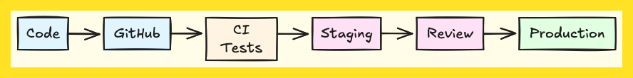
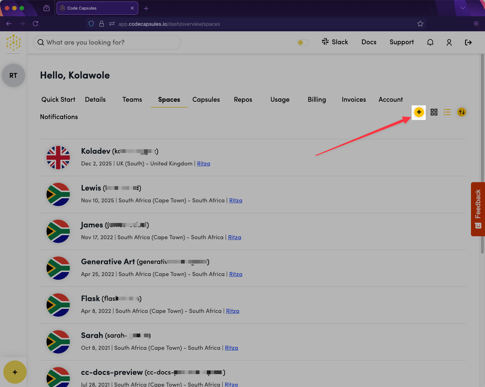
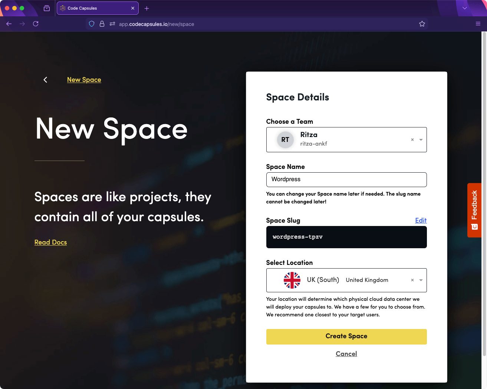
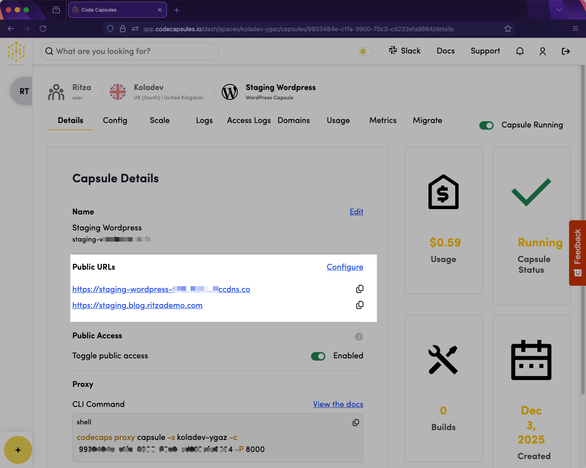
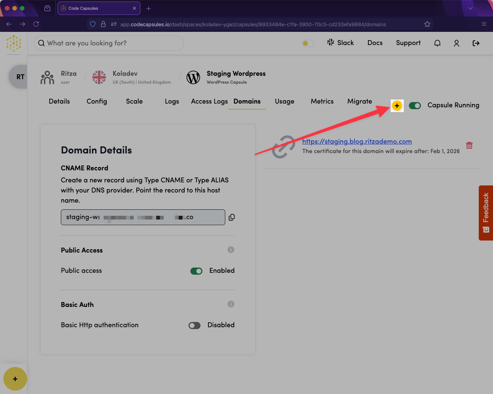
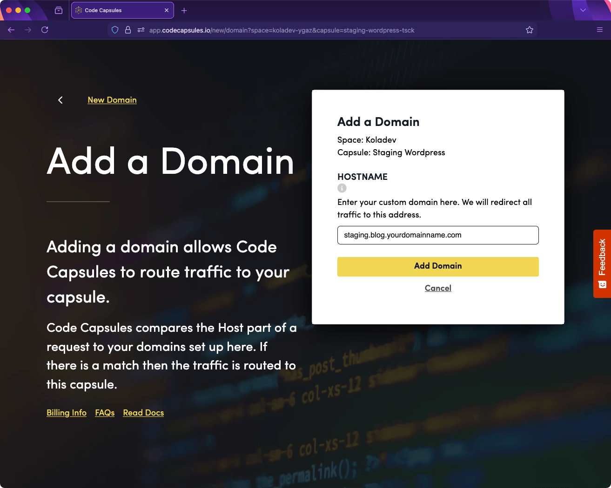
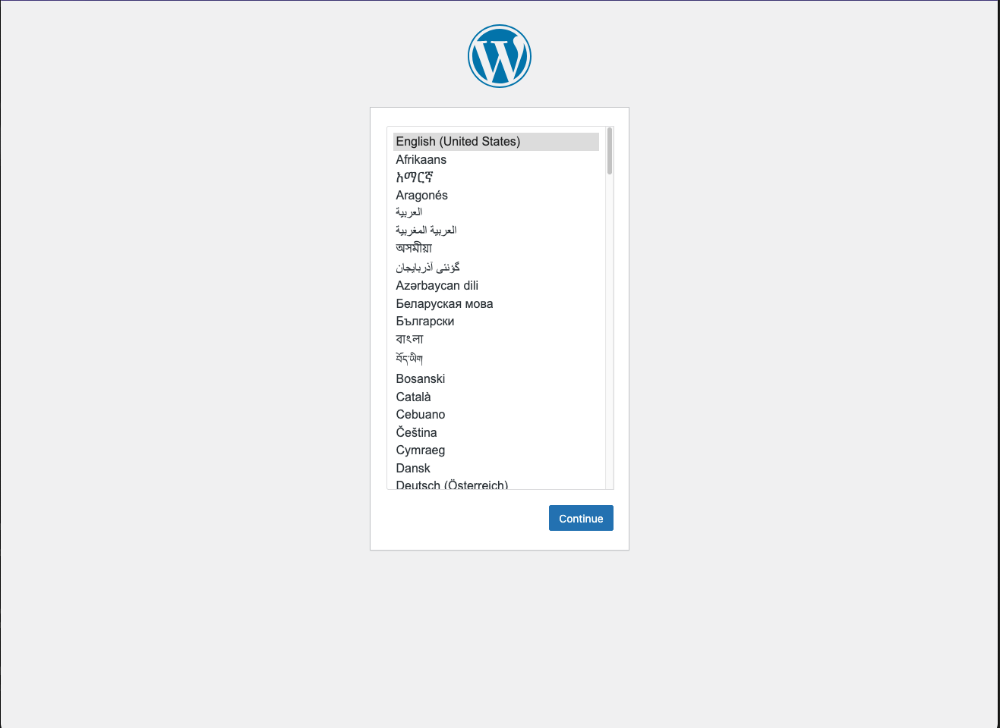
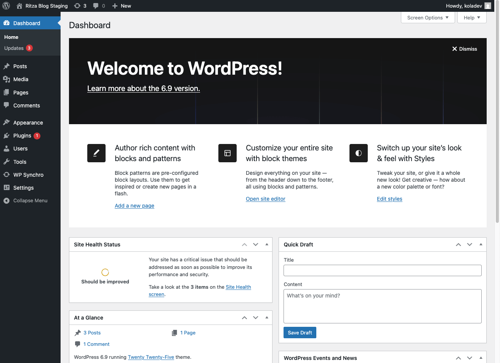

# How to (Simply) Host a Production WordPress Blog

The Amazon Web Services (AWS) WordPress reference architecture has become a meme in DevOps circles. The 2018 [best practices whitepaper](https://aws.amazon.com/blogs/architecture/wordpress-best-practices-on-aws/) recommends you use 11 services costing $500 to $1,500 monthly, and assumes you have dedicated DevOps staff. The alternative is to use a single Amazon Lightsail instance, where you handle operating system (OS) updates, security hardening, and MySQL tuning yourself.

WordPress production sites need infrastructure that is reliable enough to handle traffic spikes and hardware failures, yet simple enough to manage without a DevOps team.

This guide demonstrates how to run a production WordPress site with:

* Separate application, database, and storage layers
* One-click migration between staging and production environments
* Automatic scaling for traffic spikes
* Infrastructure-level backups

You'll learn how to deploy WordPress infrastructure, configure a content review workflow, and set up production operations for backing up, scaling, and monitoring your data.

## The WordPress Production Problem

In a development team, the workflow for releasing changes usually looks like this:

<figure><figcaption></figcaption></figure>

Your developers write code locally, commit to GitHub, run automated tests, and deploy changes to staging for review. Only after stakeholder approval does anything touch production. Every change is tracked, every deployment is reversible, and nothing reaches your live site without multiple checkpoints.

WordPress doesn't work this way.

<figure><figcaption></figcaption></figure>

WordPress splits data between files and the database, breaking Git workflows:

* You can commit theme changes to Git, but blog posts aren't in your repository.
* You can deploy code via a continuous integration and continuous delivery (CI/CD) pipeline, but you need to make database changes directly in the production site, via the WordPress admin dashboard.
* You can run tests on your code, but there's no automated testing for scenarios such as when someone installs a plugin that conflicts with your theme.
* You can roll back a bad deployment, but WordPress only rolls back file-system changes; database modifications remain, so you can't recover from bad content changes.

The split between files and the database causes production problems, like in these scenarios:

* Marketing installs a plugin on production. It conflicts with your theme, and the site breaks during business hours.
* A content creator deletes a popular post. You can't recover it because there is no Git history for database content.
* You want to test WordPress core updates on staging, but staging content is days behind production.

Your infrastructure may have version control and staging environments, but WordPress breaks standard workflows. Version control can't track database content, and staging environments drift out of sync with production without custom synchronization tooling.

WordPress migration, backups, and staging workflows each require specific approaches to work reliably in production.

## What You Need To Know

Due to these WordPress limitations, here's what you need to know to host a production WordPress site simply:

* **Separate Your WordPress Layers from the Start:** WordPress, MySQL, and file storage should run independently. When one layer fails or requires scaling, the others continue to operate.
* **Plan for Staging-to-Production Workflows:** WordPress has no built-in mechanism for migrating between environments. Either set up a plugin-based migration (which costs $99 to $299 per year with manual configuration) or use a hosting platform, like Code Capsules, that offers built-in one-click migrations. Without this, you have to recreate approved content manually or risk breaking production with direct edits.
* **Match Infrastructure to Your Team's Capacity:** A self-hosted VPS (starting from $10 per month) requires you to handle security patches, backups, and scaling. Managed WordPress removes operational work but limits flexibility and costs more (an average of $50 per month for basic plans). Always choose based on whether you have DevOps resources.

### Hosting Options For WordPress Sites

WordPress hosting options range from $5 single-server VPS setups to $1,500 AWS enterprise architectures:

* Self-hosted VPS provides complete control but requires Linux administration and manual backup management.
* AWS delivers maximum reliability but needs dedicated DevOps staff to manage 11 separate services.
* Managed WordPress providers remove server management but limit customization, and cost $35 to $100 per month.

<<<<<<< Updated upstream For a detailed comparison of hosting costs and trade-offs, see our [WordPress Hosting Cost Comparison](link/).

\=======

> > > > > > > Stashed changes

### Why Code Capsules Works Well for WordPress Hosting

Code Capsules solves the primary challenges of hosting a WordPress production site:

* Separate infrastructure layers prevent single points of failure.
* Built-in migration eliminates $99-$299 annual plugin costs.
* Infrastructure-level backups keep databases and files synchronized.

WordPress production environments require content review workflows. Writers create posts in staging, editors review and approve them, and then the changes migrate to production. WordPress provides no built-in migration mechanism. Plugin-based solutions like WP Synchro incur licensing costs, require API key management, and you still need to manually select which files and database tables to migrate.

Code Capsules provides one-click migration between staging and production WordPress Capsules, automatically handling database synchronization, file transfers, and URL updates.

## Prerequisites

To follow this tutorial, you need:

* A Code Capsules account
* Some knowledge of WordPress configuration, as you will create an admin user

### Create a Space for Hosting Your WordPress Blog on Code Capsules

Spaces organize related Capsules.

On your Code Capsules dashboard, navigate to the **Spaces** tab and click the **+** button to create a new Space.

<figure><figcaption></figcaption></figure>

Fill in the Space details and select the region closest to your target users to reduce latency for your visitors.

<figure><figcaption></figcaption></figure>

## Setting Up the WordPress Staging Site

We'll create two application Capsules in this space: one for the staging site, and one for the production site. Let's begin with staging.

### Create the WordPress Capsule

Next, you need a WordPress Capsule to serve as your staging environment.

Follow the [WordPress Capsule deployment guide](https://app.gitbook.com/s/oyCI3rJYfUxA3cJhHZbu/wordpress-capsule/deploy) to set up:

* A WordPress application Capsule running the latest WordPress version
* A MySQL Database Capsule storing posts, users, and settings
* A Storage Capsule handling uploaded media files
* A default URL like `your-wordpress-slug.ccdns.co`

### Configure Your Domain (Optional)

After deploying the WordPress Capsule, you'll see a default URL like `wordpress-slug.ccdns.co`. You can configure a custom domain for cleaner URLs.

<figure><figcaption></figcaption></figure>

Navigate to the **Domains** tab and click **+** to add a domain.

<figure><figcaption></figcaption></figure>

On the domain configuration page, enter your staging domain, for example, `staging.blog.yourdomain.com`.

<figure><figcaption></figcaption></figure>

Code Capsules provides DNS instructions. Create a CNAME or ALIAS record with your DNS provider pointing to the provided hostname.

### Build the Site Structure in WordPress

After creating the Capsules, you need to install the WordPress staging site. Visit your WordPress URL and select your language.

<figure><figcaption></figcaption></figure>

Create your admin account. Use a strong password, since this account has full site access.

<figure><figcaption></figcaption></figure>

Once WordPress has been installed, you'll receive a success notification.

<figure><figcaption></figcaption></figure>

Click **Log In** to verify the installation and open the WordPress admin dashboard for your staging site.

<figure><figcaption></figcaption></figure>

Navigate to the website homepage. The WordPress Capsule sets up a default homepage similar to the following:

<figure><figcaption></figcaption></figure>

Code Capsules includes three default WordPress themes, Twenty Twenty-Five (active in the screenshot), Twenty Twenty-Four, and Twenty Twenty-Three. These blog-focused templates display posts on the homepage by default.

To change themes, navigate to **Appearance** → **Themes**.

<figure><figcaption></figcaption></figure>

### Create User Accounts

To create user accounts, navigate to **Users** in the WordPress side panel and click **Add User**.

<figure><figcaption></figcaption></figure>

Fill the form with the user's information and select a role.

<figure><figcaption></figcaption></figure>

From the **Role** dropdown, select **Admin**, **Contributor**, **Editor**, or **Author**. These roles determine permissions for content creation and review in your staging-to-production workflow.

Your staging environment is ready. You can install themes, add plugins, and create content for review before pushing to production.

### Create a Sample Post

To demonstrate the content review workflow, create a sample blog post in your staging environment.

Navigate to **Posts** → **Add Post**.

<figure><figcaption></figcaption></figure>

Enter a post title and content. For this example, create a post titled `Welcome to Our Blog` with sample content about your company or services. Then, click **Publish** to make the post visible on your staging site. Visit your staging site to verify that the post appears.

## Setting Up the WordPress Production Site

Create a second WordPress Capsule for production using the same [WordPress Capsule deployment guide](https://app.gitbook.com/s/oyCI3rJYfUxA3cJhHZbu/wordpress-capsule/deploy). Use clear naming to distinguish environments:

* **Capsule name:** `Production WordPress`
* **Database Capsule:** `Production WordPress Database`
* **Storage Capsule:** `Production WordPress Storage`
* **Domain:** `yourblog.com` (or `blog.yourdomain.com`)

This separates production data completely from staging. Changes in staging won't affect production until you explicitly migrate them.

## Migrating Content from Staging to Production with Code Capsules

In your production WordPress Capsule (the target Capsule), navigate to the **Migrate** tab. Select your staging WordPress Capsule as the **Source Capsule**.

Click **Start Migration**. Code Capsules copies your database content, uploaded media files, installed plugins, and theme configurations from staging to production.

<figure><figcaption></figcaption></figure>

After migration, the production environment contains the same content as the staging environment.

## Managing WordPress Production Sites with Code Capsules

A WordPress production site requires maintenance. Code Capsules provides features to help you maintain WordPress sites by:

* **Backing Up Site Data Regularly:** Ensure you can recover from hardware failures and other problems.
* **Enabling the Site To Scale as You Grow:** Adjust resources so that the site can handle spikes in user traffic.
* **Monitoring Performance and User Interactions:** Detect errors and resolve issues before they affect users.

### Create Backups

Because WordPress data is separated into database and file storage, you need to back up both simultaneously.

Code Capsules provides infrastructure-level backups using automatic daily snapshots with 30-day retention for your WordPress Database Capsule (containing the posts, users, and settings in the database) and Storage Capsule (containing the themes, plugins, and media in file storage).

Configure and manage your backups with the following guides:

* [**Database Capsule Backups**](https://app.gitbook.com/s/oyCI3rJYfUxA3cJhHZbu/database-capsule/backups)**:** Configure retention and restore database snapshots.
* [**Storage Capsule Backups**](https://app.gitbook.com/s/oyCI3rJYfUxA3cJhHZbu/storage-capsule/backups)**:** Manage your file storage backup settings.

Test backup restoration quarterly to verify that backups work when needed.

### Scale Your Site

Websites scale either horizontally (by adding more instances) or vertically (by adding more resources per instance). Code Capsules uses vertical scaling.

Code Capsules handles scaling by letting you allocate more resources to your Capsules:

* Open your WordPress Capsule and navigate to the **Scale** tab.
* Click **Edit**, select **Custom**, and use the slider to adjust the Capsule's allocated resources.

You can also set up scaling rules to automatically adjust the site's capacity based on traffic. To learn more, visit our [WordPress scaling documentation](https://app.gitbook.com/s/oyCI3rJYfUxA3cJhHZbu/wordpress-capsule/scale).

### Observe and Monitor Your Site

Use the following Code Capsules capabilities to monitor your WordPress site.

* [**Monitoring**](https://app.gitbook.com/s/oyCI3rJYfUxA3cJhHZbu/wordpress-capsule/monitor)**:** View real-time metrics for CPU, memory, and traffic. Identify performance trends and resource constraints.
* [**Logs**](https://app.gitbook.com/s/oyCI3rJYfUxA3cJhHZbu/wordpress-capsule/logs)**:** Access application logs directly from the dashboard. Filter by severity, search for specific errors, and troubleshoot issues without server access.

<figure><figcaption></figcaption></figure>

* [**Access Logs**](https://app.gitbook.com/s/oyCI3rJYfUxA3cJhHZbu/wordpress-capsule/logs)**:** Track actions performed by WordPress users in the admin interface.

<figure><figcaption></figcaption></figure>

* [**Alerting**](https://app.gitbook.com/s/oyCI3rJYfUxA3cJhHZbu/wordpress-capsule/alerting)**:** Configure alerts for high CPU usage, error rates, and downtime. Receive notifications via email or webhooks before users report problems.
* [**Metrics**](https://app.gitbook.com/s/oyCI3rJYfUxA3cJhHZbu/wordpress-capsule/monitor)**:** Check resource usage on the machine.

<figure><figcaption></figcaption></figure>

### Best Practices in WordPress

A WordPress production site requires ongoing maintenance beyond infrastructure management:

* **Security:** Keep the WordPress core, themes, and plugins up to date. Security patches address vulnerabilities that attackers exploit.
* **Update Strategy:** WordPress releases regular updates. Code Capsules supports updates without issues, but always review changelogs before updating. Test updates on staging before applying to production.
* **Password Management:** Use strong, unique passwords for all WordPress accounts. Enable two-factor authentication where possible.
* **Backup Verification:** Test backup restoration quarterly to verify that backups work when needed.
* **Plugin Audits:** Review your installed plugins monthly. Remove unused plugins and update active ones.
* **Schedule Monitoring Tasks:** Review error logs and performance metrics weekly; test the staging-to-production migration workflow monthly; and audit the security and test backup restoration quarterly.

## Conclusion

You now know the three keys to hosting a production WordPress blog without single-server fragility or AWS enterprise complexity:

* Independent application, database, and storage layers
* A reliable staging-to-production workflow
* Scalable site management infrastructure

With separate Capsules for each layer of the site, built-in staging-to-production migration, and automatable scaling options, Code Capsules provides a simple hosting solution, so you can focus on creating content.
