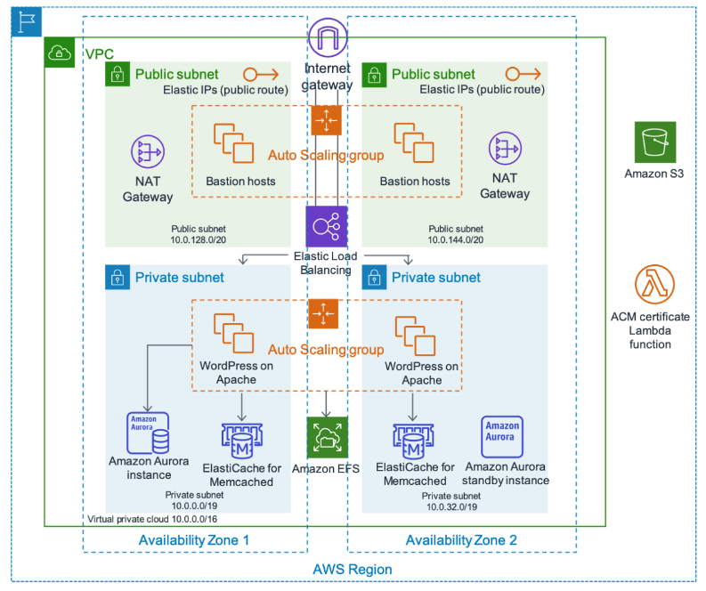
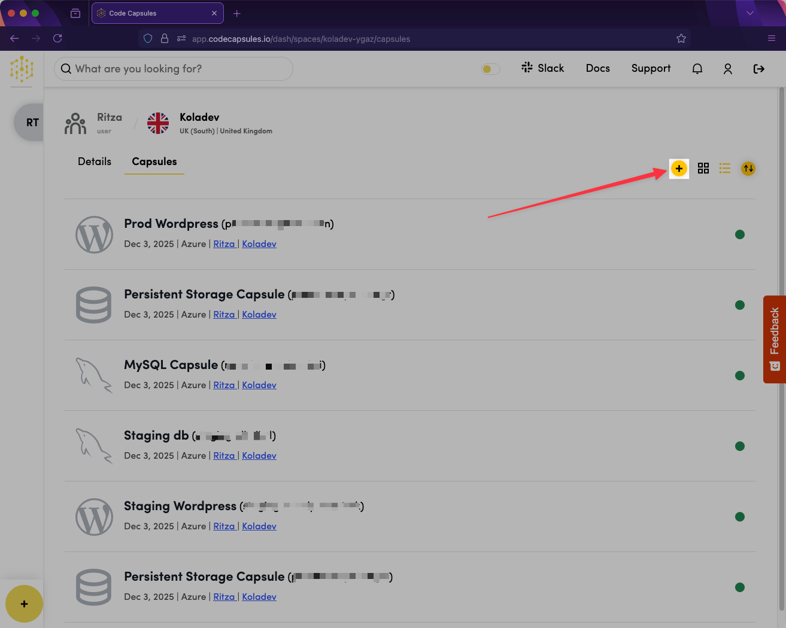
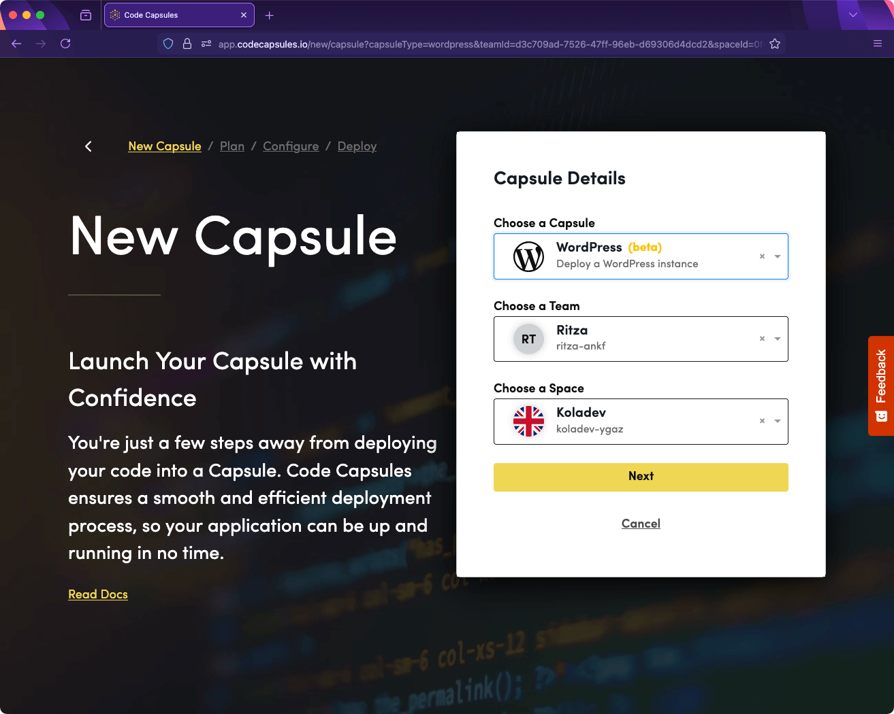
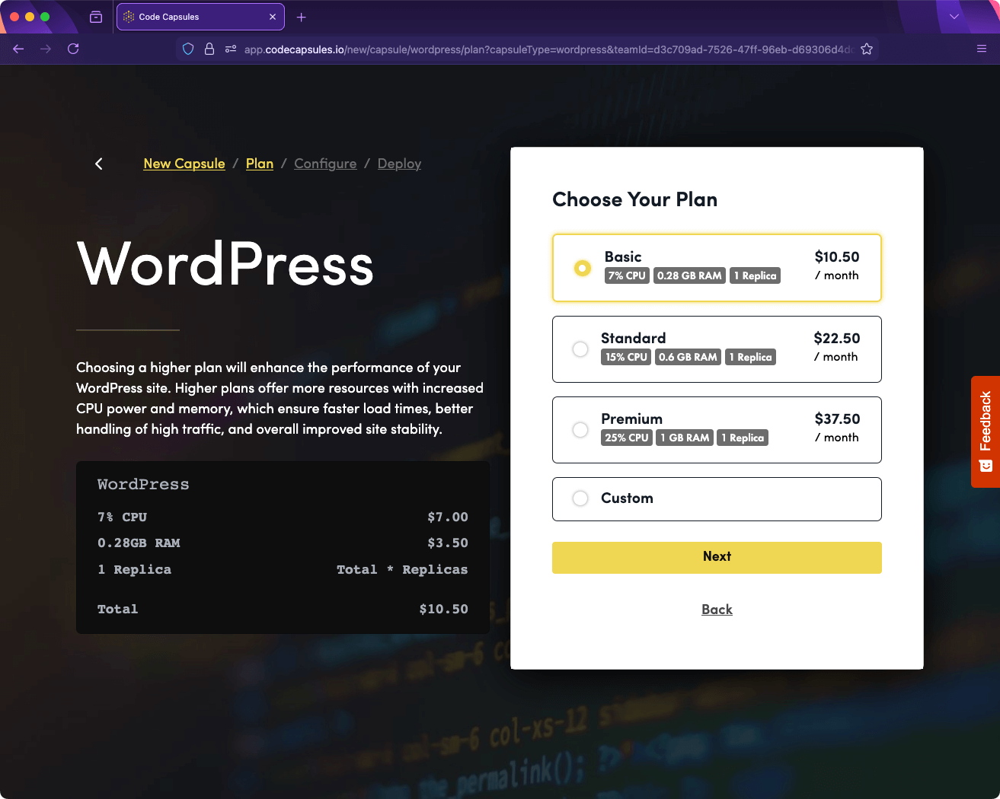
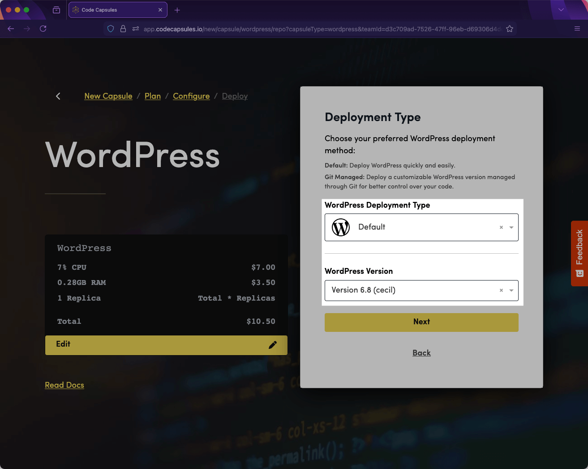
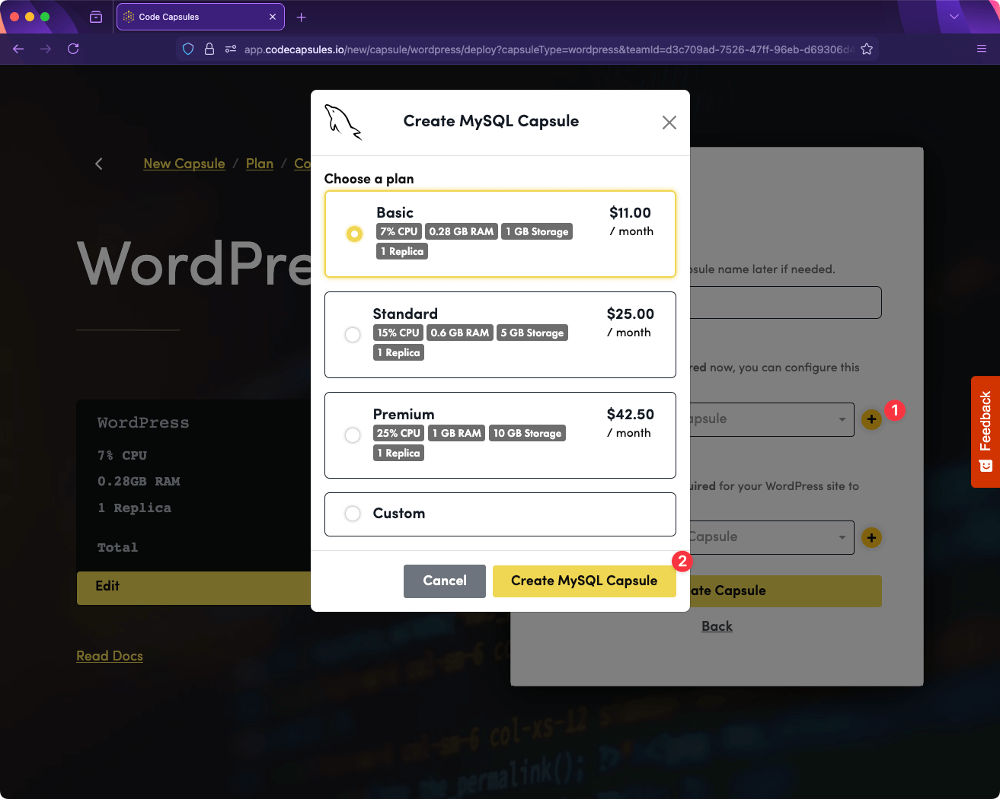
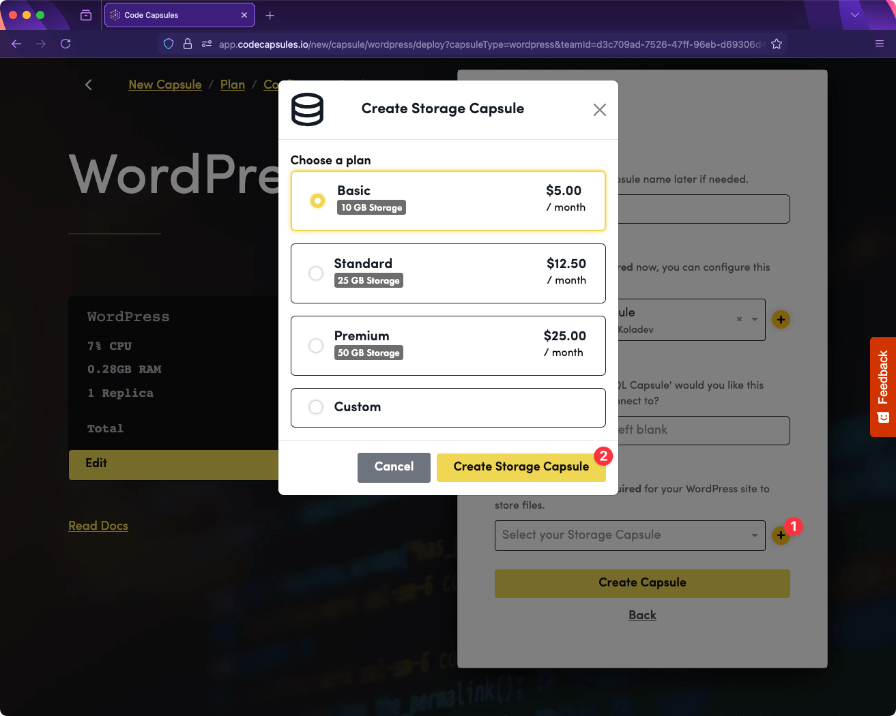
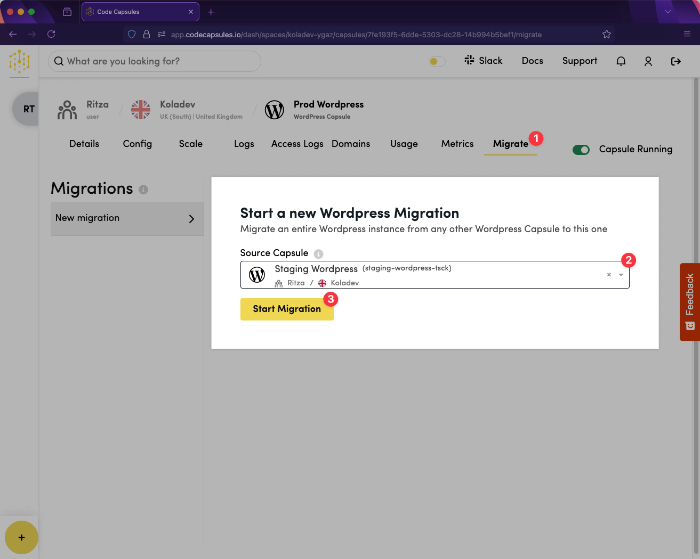
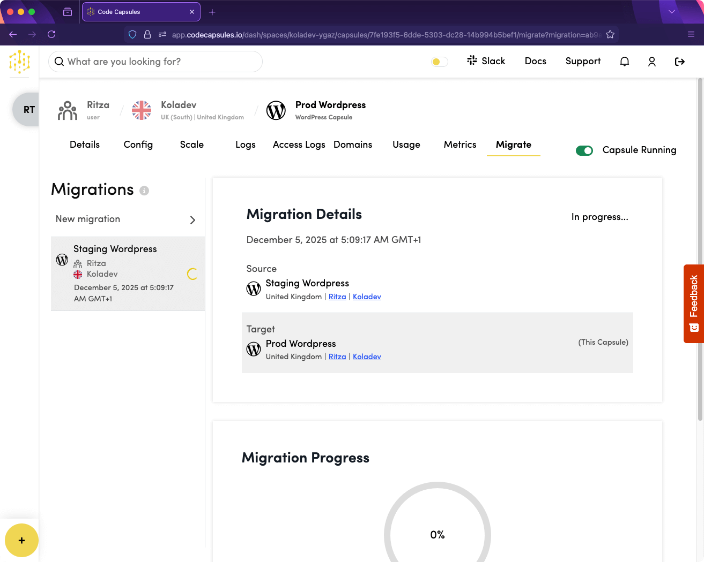

# How to Simply Host a Production WordPress Blog

AWS's [WordPress reference architecture](https://aws.amazon.com/blogs/architecture/wordpress-best-practices-on-aws/) became a meme in DevOps circles. The 2018 whitepaper recommends 11 services: CloudFront, Application Load Balancer, Auto Scaling EC2 instances, EFS, Aurora, ElastiCache, NAT Gateways, S3, VPC networking, and bastion hosts, costing $500-1,500 monthly. The architecture assumes you have dedicated DevOps staff to monitor, maintain, and debug across all these services.

AWS's alternative is a single Lightsail instance you configure yourself. You handle OS updates, security hardening, backup scripts, MySQL tuning, and disaster recovery. When traffic spikes, your site crashes. When hardware fails, you're offline until you manually rebuild.

Small businesses need production WordPress somewhere between these extremes: reliable enough to handle traffic spikes and hardware failures, simple enough to manage without DevOps expertise, and affordable enough to justify for a blog.

This tutorial shows how to deploy WordPress on Code Capsules with:

- Separate application, database, and storage layers for reliability.
- Staging and production environments with one-click migration.
- Auto-scaling that handles traffic spikes without manual intervention.

You'll create a staging environment, configure custom domains, and migrate content to production, without writing deployment scripts or managing server infrastructure.

## Why Is a Single WordPress Server Architecture Underengineered

Most WordPress hosts offer a single-server option: one virtual machine running Apache, PHP, MySQL, and file storage. DigitalOcean droplets, AWS Lightsail, and Linode VPS all follow this pattern. For personal blogs with occasional traffic, this works.

For business blogs, single servers create four critical problems:

- Traffic spikes crash your site. Your marketing team sends a newsletter, 500 concurrent users hit your server, and 500 PHP processes overwhelm the CPU while database connections exhaust MySQL. Your site returns 503 errors to potential customers.

- Hardware failures mean downtime. Cloud instances fail, servers reboot for maintenance, plugin updates crash PHP, and each scenario takes your entire site offline until you manually intervene.

- Vertical scaling hits a ceiling. You can only upgrade to larger instances until you hit the maximum size, and you pay for peak capacity 24/7 even when traffic drops to 10% overnight.

- Security compromises everything. Successful attacks on WordPress give attackers access to your database, uploaded files, environment variables, and, potentially, your cloud provider credentials, with no isolation layers.

## Why AWS Enterprise Architecture is Overengineered

AWS recommends an architecture with 11 services for production WordPress:

- CloudFront CDN caching content at 450+ edge locations globally.
- Application Load Balancer distributing traffic across multiple web servers.
- Auto Scaling group of EC2 instances, automatically adding/removing capacity.
- Amazon EFS providing shared file storage for all web servers.
- Amazon S3 hosting static assets (images, CSS, JavaScript).
- Amazon Aurora running a distributed, multi-AZ MySQL database.
- ElastiCache providing in-memory caching with Memcached/Redis.
- VPC with public/private subnets, NAT gateways, security groups.
- Bastion hosts for secure administrative access.

This architecture solves the single-server problems but creates three new ones:

- High financial cost. Running 11 services costs $500-1,500 monthly versus $10-40 for a single server, with hidden data transfer charges between services that spike unexpectedly during traffic increases.
- Maintenance hell. Monitoring and keeping 11 different services healthy simultaneously requires dedicated DevOps expertise that most small teams don't have.
- Debugging purgatory. When something breaks, the problem could be in CloudFront, the load balancer, an EC2 instance, EFS, Aurora, ElastiCache, or VPC networking. Troubleshooting can take hours.

Also note that production WordPress requires staging environments for testing changes before publishing. Still, AWS provides no built-in migration path, so you need expensive sync plugins ($200+/year) or custom deployment scripts that risk database corruption.

## What a Production WordPress Application Actually Needs

Production WordPress needs three architectural components:

- **Separate application, database, and storage servers.** When traffic spikes, the application server doesn't die handling SQL queries and file storage; each layer scales independently based on its bottleneck.
- **Staging and production environments with simple migration.** Content creators test changes on staging, stakeholders review, and then changes move to production without custom scripts or expensive plugins.
- **Auto-scaling that handles traffic without manual intervention.** When newsletter traffic hits, servers spin up automatically and shut down when traffic normalizes. You pay for capacity only when you need it.

Code Capsules provides this architecture without the AWS complexity: you deploy WordPress as separate capsules for application, database, and storage, each scaling independently. Built-in migration moves content from staging to production with one click.

## Hosting a WordPress Blog on Code Capsules

To follow this tutorial, you need:

- A Code Capsules account.
- Some knowledge of WordPress configuration is required, as you will create an admin user.

### Create a Space

Spaces organize related capsules. Click the **+** button on the dashboard to create a new space.

Fill in the space details and select the region closest to your target users to reduce latency for your visitors.

### Create the WordPress Capsule

Navigate to your new space and click the **+** button to create a capsule.

Select **WordPress** as the capsule type, choose your team and space.

Choose a plan based on your expected traffic. Use the [Code Capsules pricing calculator](https://app.codecapsules.io/pricing-calculator) to estimate costs for your monthly visitors and storage needs.

On the deployment page, select **Default** – Code Capsules provides a ready WordPress instance.

The **Custom** option lets you deploy from your own Git repository if you have a customized WordPress setup.

### Configure Database and Storage

In the next page, name the capsule **Staging WordPress**.

Click the **+** button next to Database to create a new database capsule. This separates your MySQL database from your application server, when traffic spikes hit your WordPress application, your database continues responding normally. Choose a database plan that matches your content volume.

Click the **+** button next to Storage to create a storage capsule. This handles uploaded images, videos, and media files separately from your application server. Choose a storage plan based on your media library size.

Your configuration should show Staging WordPress with attached database and storage capsules.

Click **Create Capsule**.

### Configure Your Domain (Optional)

Once the capsule deploys, you'll see a default URL like `staging-wordpress-slug.ccdns.co`. Configure a custom domain for cleaner URLs.

Navigate to the **Domains** tab and click **+** to add a domain.

You will be redirected to a page to enter the custom domain address. Enter your staging domain, for example, `staging.blog.yourdomain.com`.

Code Capsules provides DNS instructions. Create a CNAME or ALIAS record with your DNS provider pointing to the provided hostname.

### Complete WordPress Setup

Visit your WordPress URL. Select your language.

Create your admin account. Use a strong password since this account has full site access.

Once the installation is successful, you will see the following page.

Log in to verify the installation. You'll see the WordPress admin dashboard.

Your staging environment is ready. You can install themes, add plugins, and create content for review before pushing to production.

## Managing Staging and Production Environments

Production WordPress needs staging environments where you test content changes, plugin updates, and theme modifications before publishing to your live site.

WordPress provides no built-in way to move changes from staging to production. You have two common options, both problematic:

- Sync plugins: Tools like WP Synchro sync files and database changes between environments, but premium features cost $200+/year and complex sites often hit sync conflicts requiring manual intervention.
- Custom scripts: You can write deployment scripts that export staging databases and copy files to production storage, but this risks data corruption if the script fails mid-migration or if database schemas don't match.

### Create Your Production Environment

Create a new WordPress capsule following the same steps as staging, but name it **Production WordPress**. Attach new database and storage capsules to keep production data completely separate from staging.

Skip the WordPress admin setup as you'll migrate your staging content instead.

In your Production WordPress capsule, navigate to the **Migrate** tab. Select **Staging WordPress** as the source capsule.

Click **Start Migration**. Code Capsules copies your database content, uploaded media files, installed plugins, and theme configurations from staging to production.

Once complete, your production environment has identical content to staging. Configure your production domain (like `blog.yourdomain.com`) following the same DNS setup process from the staging section.

Your staging and production environments are now independent: writers create posts on staging, editors review the content, then you migrate approved changes to production with one click.

## Conclusion

WordPress hosting doesn't require choosing between single-server fragility and AWS enterprise complexity. Code Capsules provides separated application, database, and storage layers with built-in staging-to-production migration.

With Code Capsules, your WordPress infrastructure now handles traffic spikes through auto-scaling, survives hardware failures through component separation, and deploys content changes through one-click migration. You can focus on creating content instead of maintaining servers.

For production operations, Code Capsules provides:

- [Monitoring](https://docs.codecapsules.io/products/wordpress-capsule/monitor) for tracking performance metrics.
- [Logs](https://docs.codecapsules.io/products/wordpress-capsule/logs) for debugging issues.
- [Scaling rules](https://docs.codecapsules.io/products/wordpress-capsule/scale) for automatic capacity adjustments.
- [Alerting](https://docs.codecapsules.io/products/wordpress-capsule/alerting) for proactive issue detection.
